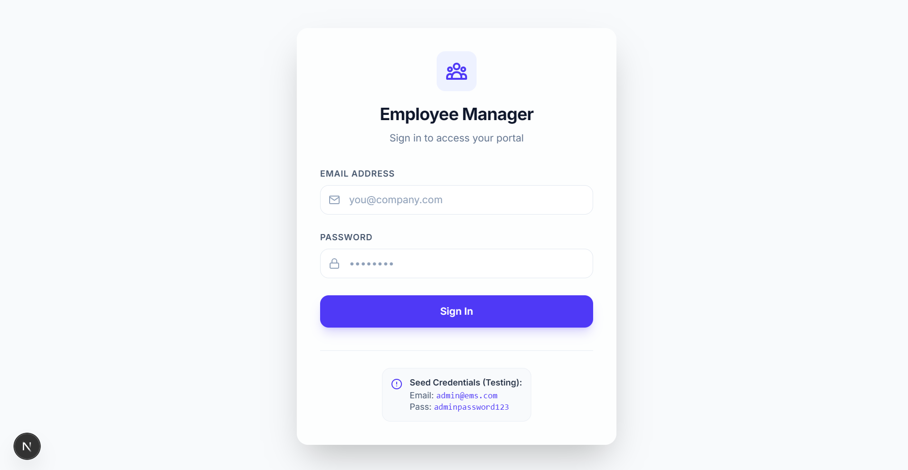

# Employee Management System (EMS)

A comprehensive, full-stack, enterprise-grade Employee Management System featuring secure JWT-based Role-Based Access Control (RBAC), recursive organizational hierarchies, csv bulk imports, and a premium real-time data visualization dashboard.

---


## Screenshots

1. Login page



2. Dashboard page


3. Employee management


## Architecture & Tech Stack

This project is separated into a client-server architecture:

```text
employee-management/
├── client/              # Next.js 16 (App Router), React 19, Tailwind CSS v4, Lucide
└── server/              # Node.js, Express, TypeScript, Mongoose, MongoDB, Zod, Jest
```

### Core Features
1. **Dynamic Dashboard**: Interactive widgets visualizing operational counts, department headcounts, role divisions, and joining trends (cumulative headcount expansion).
2. **Secure Authentication**: Cookie-based JWT authentication with session guards.
3. **Role-Based Access Control (RBAC)**: Custom permissions for `Super Admin`, `HR Manager`, and `Employee` roles.
4. **Interactive Org Tree**: Full recursive organizational hierarchy chart.
5. **CSV Bulk Import**: Robust multi-row importing validation parser for quickly seeding employee lists.
6. **Smart Manager Assignment**: Programmatic check to block circular reporting lines.
7. **Robust Validation & Error Handling**: Comprehensive Zod schemas and global custom error middleware.

---

## Quick Start (Docker Compose)

The easiest way to spin up the entire application, including the database, is using Docker Compose:

```bash
# Clone the repository and navigate to root directory
cd employee-management

# Spin up all services
docker-compose up --build
```

* **Client UI**: [http://localhost:3000](http://localhost:3000)
* **Backend API**: [http://localhost:5000](http://localhost:5000)
* **Database**: `mongodb://localhost:27017`

---

## Manual Running & Development Setup

If you prefer to run the client and server processes independently for local development, follow the links below for instructions:

* **Backend Service**: See [Server README & API Documentation](./server/README.md) for full configuration, seed commands, API endpoint details, and unit test details.
* **Frontend Service**: See [Client README](./client/README.md) for starting the Next.js development server.

---

## Seeding Default Admin Credentials

When running locally or via Docker Compose, you can run the seeding command to insert the default **Super Admin** account:

```bash
# In the /server directory:
npm run seed
```

* **Default Super Admin Login**:
  * **Email**: `admin@ems.com`
  * **Password**: `adminpassword123`